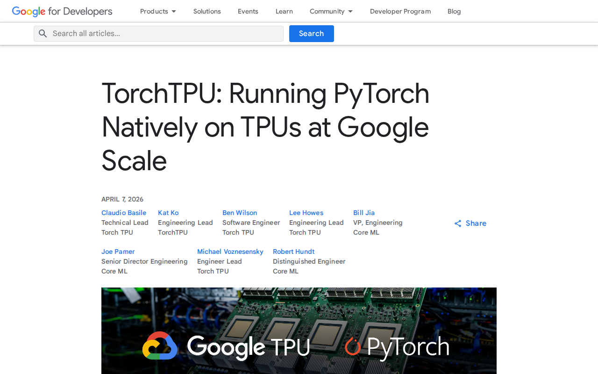

<!-- _class: title -->

# Beyond the Queue

## HPC + AI on Google Cloud

Willis Zhang · Google Cloud

---

## Current conditions

  
$190B

  
Alphabet 2026 CapEx, mostly AI

  
<strong><a href="https://cloud.google.com/ai-infrastructure">90%</a></strong> of generative AI unicorns run on Google Cloud AI infrastructure.

---

<!-- _class: section -->

# NVIDIA on Google Cloud

---

<!-- _class: compact -->

## Every cloud has H100s. We add this:

  

<a href="https://cloud.google.com/blog/products/networking/introducing-virgo-megascale-data-center-fabric">Optical Circuit Switching</a>

Failed chip → job survives, no restart.

  

<a href="https://docs.cloud.google.com/ai-hypercomputer/docs/workloads/enable-node-health-prediction">Node Health Prediction</a>

ML drains nodes 5h before degradation.

  

<a href="https://docs.cloud.google.com/kubernetes-engine/docs/how-to/machine-learning/training/multi-tier-checkpointing">Multi-Tier Checkpointing</a>

RAM → peer node → Cloud Storage recovery.

  

<a href="https://docs.cloud.google.com/cluster-director/docs/orchestration">Topology-aware Slurm</a>

Cluster Director exposes sub-block metadata to Slurm.

  

<a href="https://docs.cloud.google.com/ai-hypercomputer/docs/networking-overview">Rail-aligned networking</a>

Predictable hops at thousand-GPU scale.

  

<a href="https://cloud.google.com/blog/products/ai-machine-learning/goodput-metric-as-measure-of-ml-productivity">Goodput</a>

Public metric for ML productivity.

---

## and also storage

  

<a href="https://docs.cloud.google.com/managed-lustre/docs/overview">Managed Lustre</a>

10 TB/s

  

<a href="https://cloud.google.com/kubernetes-engine/docs/how-to/persistent-volumes/cloud-storage-fuse-csi-driver">Cloud Storage as POSIX</a>

9×model loads

30×checkpoint writes

  

<a href="https://docs.cloud.google.com/storage/docs/rapid/rapid-cache">Rapid Storage</a>

6 TB/s

---

<!-- _class: section yellow -->

# How you consume

---

## Capacity without a commit

  

<a href="https://docs.cloud.google.com/kubernetes-engine/docs/concepts/dws">DWS Flex Start</a>

7-day guaranteed. No contract.

  

<a href="https://docs.cloud.google.com/compute/docs/instances/future-reservations-calendar-mode-overview">Calendar Mode</a>

Reserve specific date windows up to 90 days out.

  

<a href="https://github.com/WandLZhang/slurm-multi-region-gpu">Multi-region Spot</a>

Thousands of chips across CONUS. Preempt → resume elsewhere.

  

<a href="https://cloud.google.com/kubernetes-engine/docs/concepts/fast-starting-nodes">BoltVMs</a>

H100 cold-start in ~2 minutes.

---

<!-- _class: compact -->

## Reimagine what a node is

  

<a href="https://docs.cloud.google.com/batch/docs/nextflow">Nextflow on Cloud Batch</a>

DWS Flex guarantees GPUs for nf-core pipelines.

  

<a href="https://docs.cloud.google.com/compute/docs/accelerator-optimized-machines#g4-series">G4 fractional GPUs</a>

1/8, 1/4, or 1/2 of an RTX PRO 6000 Blackwell.

  

<a href="https://docs.cloud.google.com/kubernetes-engine/docs/how-to/tpus">TPU + GPU in one cluster</a>

Mixed accelerators, single GKE cluster.

  

<a href="https://docs.cloud.google.com/kubernetes-engine/docs/how-to/image-streaming">Image Streaming</a>

Pods start while 50 GB CUDA images download. No cold-start tax.

  

<a href="https://cloud.google.com/run/docs/configuring/services/gpu">Cloud Run with GPUs</a>

Model → REST endpoint. Scale-to-zero, no Kubernetes.

  

<a href="https://docs.cloud.google.com/kubernetes-engine/docs/how-to/checkpoint-restore">Pod Snapshots</a>

80% faster warm restart for 70B models.

  

<a href="https://docs.cloud.google.com/kubernetes-engine/docs/concepts/about-gke-inference-gateway">Inference Gateway</a>

Model-aware routing. 70% faster time-to-first-token vs standard load balancing.

---

<!-- _class: section green -->

# TPU

---

## Who runs on TPUs

  

<a href="https://www.anthropic.com/news/expanding-our-use-of-google-cloud-tpus-and-services">Anthropic</a>

1M chips

For Claude.

  

<a href="https://www.networkworld.com/article/4015386/openai-tests-google-tpus-amid-rising-inference-cost-concerns.html">OpenAI</a>

20–40% cheaper

ChatGPT inference vs GPU.

  

<a href="https://arxiv.org/abs/2407.21075">Apple</a>

8,192 chips

Foundation Models on TPUv4.

  

<a href="https://medium.com/@kshitizrimal/tpu-vs-gpu-the-shift-from-general-purpose-to-pure-performance-da04cf39c75c">Midjourney</a>

$2M → $700K

Monthly compute.

  

<a href="https://siliconangle.com/2026/02/26/google-meta-reportedly-strike-new-multibillion-dollar-ai-chip-deal/">Meta</a>

Llama + ranking

Multi-year TPU lease, Feb 2026.

  

<a href="https://cloud.google.com/customers/recursion">Recursion Pharma</a>

Drug discovery

Neural net training at scale.

---

## Why TPU economics are structural

  

vs GB200

30%

Lower TCO/hr.

  

vs GB300

41%

Lower TCO/hr.

  

Realized MFU

40 / 30

52% lower cost per effective PFLOP.

  

<a href="https://www.anthropic.com/news/claude-opus-4-5">Claude Opus</a>

67%

API price cut.

NVIDIA [paid ~$20B for Groq's LPU](https://www.cnbc.com/2025/12/24/nvidia-groq-deal.html) — the inference architecture Google has had since 2015.

---

## NeuralGCM

  

    

Legacy HPC

19 sims

13,824 CPU cores.

    

JAX

70,000 sims

Single TPU chip.

  

  

    <video src="visuals/NeuralGCM-MP4-3.mp4" autoplay loop muted playsinline></video>
    
3,500× faster atmosphere simulation

  

---

<!-- _class: compact -->

<h2 style="color: var(--gps-ink)">Cellular Interaction Foundation Model · Caltech</h2>

1B GNN, Parkinson's simulations for [Michael J. Fox Foundation](https://www.michaeljfox.org/)

  

    <h3>Inference results</h3>
    <table>
      <tr><td>Baseline on-prem</td><td>H200</td><td>10 min</td></tr>
      <tr><td>Google Cloud</td><td>TPU v7x</td><td>1.4 min</td></tr>
    </table>
    <h3>Planned model retrain</h3>
    <table>
      <tr><td>Baseline on-prem</td><td>H200</td><td>1 month</td></tr>
      <tr><td>Google Cloud</td><td>TPU v5p</td><td>8.3 days</td></tr>
    </table>
  

  

    
  

  10K experiments · GPU · $53,000
  10K experiments · TPU · $8,900

---

<!-- _class: image -->

---

## Live demo

---

<!-- _class: title -->

# Wrap

Four pillars covered:

  NVIDIA, integrated
  Capacity without a commit
  TPU economics
  HPC storage tier

williszhang@google.com

